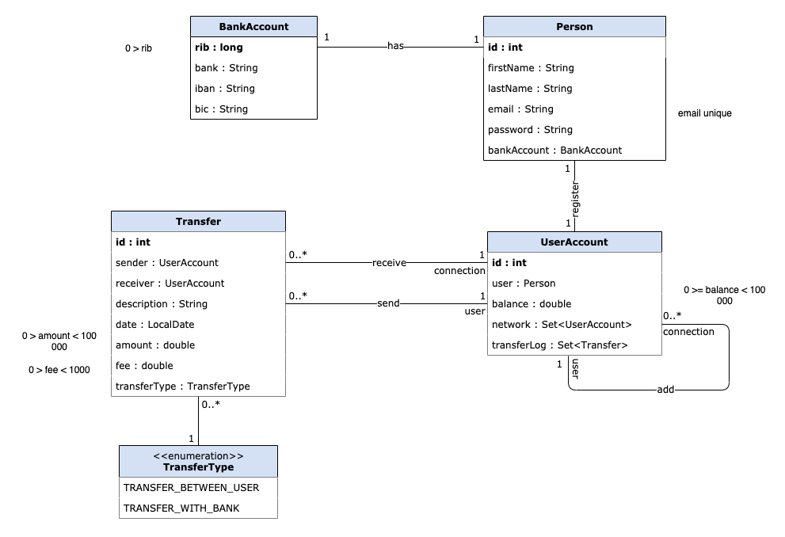
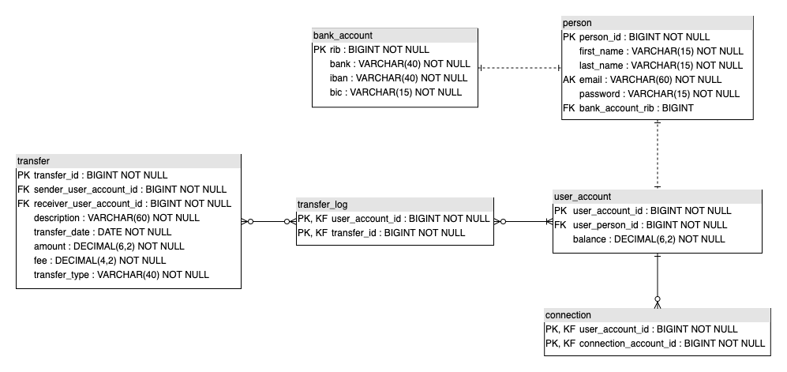

# Pay My Buddy - work in progress

Application runs with a MySQL Database.
Add properties.file to configure properties as set password and username, set server-port...
Run script create_database.sql before first use and set ddl-auto to update.

## Business Logic
In this app, we consider that only one bank account is available per user.

### Class diagram

### Data model
